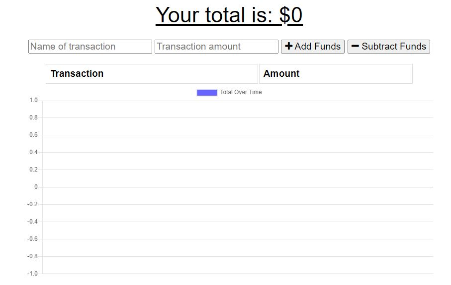
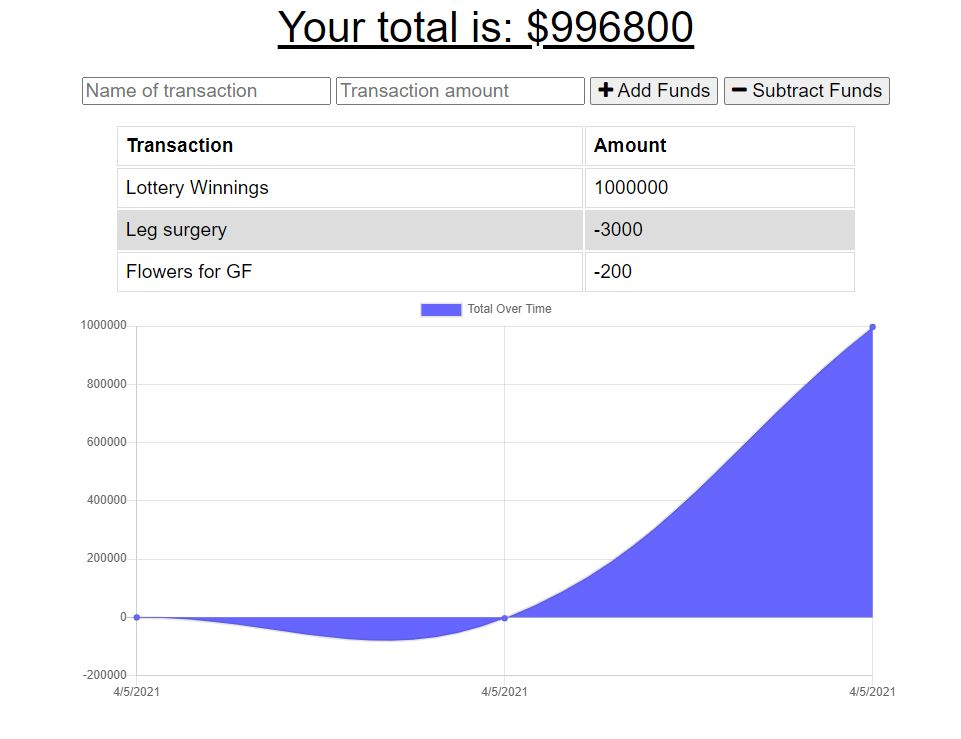

## Budget Tracker 

## Description
Whether you're connected to the internet, or you're nowhere near a wifi hotspot, this app will help you keep track of your spendings.

## Instructions
In the top two entry fields, enter the name of the transaction, followed by the transaction amount.
If you spend money, click "subtract funds", if you made money, click "add funds".
The transaction and the amount spent or gained will appear below.

## Technology Used
Node.js, JavaScript, Express, MongoDB, Heroku, Atlas, PWA, IndexedDB

## App Features

## URL to Deployed App
https://hidden-garden-06120.herokuapp.com/

## License

Copyright (c) 2021 mvanni4994

Permission is hereby granted, free of charge, to any person obtaining a copy of this software and associated documentation files (the "Software"), to deal in the Software without restriction, including without limitation the rights to use, copy, modify, merge, publish, distribute, sublicense, and/or sell copies of the Software, and to permit persons to whom the Software is furnished to do so, subject to the following conditions:

The above copyright notice and this permission notice shall be included in all copies or substantial portions of the Software.

THE SOFTWARE IS PROVIDED "AS IS", WITHOUT WARRANTY OF ANY KIND, EXPRESS OR IMPLIED, INCLUDING BUT NOT LIMITED TO THE WARRANTIES OF MERCHANTABILITY, FITNESS FOR A PARTICULAR PURPOSE AND NONINFRINGEMENT. IN NO EVENT SHALL THE AUTHORS OR COPYRIGHT HOLDERS BE LIABLE FOR ANY CLAIM, DAMAGES OR OTHER LIABILITY, WHETHER IN AN ACTION OF CONTRACT, TORT OR OTHERWISE, ARISING FROM, OUT OF OR IN CONNECTION WITH THE SOFTWARE OR THE USE OR OTHER DEALINGS IN THE SOFTWARE.
